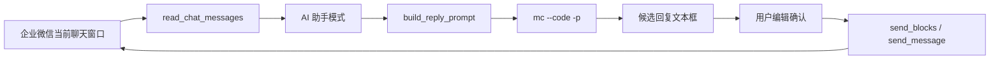

# 企业微信 AI 回复助手侧栏设计

**日期：** 2026-06-04
**状态：** 已确认设计，待实现计划

---

## 背景

当前产品是 macOS 企业微信快捷发送面板：通过 Accessibility API 读取企业微信窗口和聊天内容，通过剪贴板与系统事件把用户确认后的话术发送到当前聊天窗口。现有 GUI 已支持话术分组、搜索、变量替换、发送预览、自定义消息、权限引导和读取聊天内容弹窗。

新需求是在现有产品上增加一个企业微信边栏附加应用能力：读取当前企业微信聊天上下文，调用公司命令行 AI（`mc --code`）生成回复术语，用户确认后发回企业微信。

已验证本机可用命令：

```bash
mc --code -p --tools "" --no-session-persistence "只输出两个字：可以"
```

该命令能一次性返回文本并退出，适合作为后台 AI 回复生成入口。

---

## 产品目标

第一版做成完整可用的客服回复辅助流程：

1. 用户在企业微信中选中一个聊天窗口。
2. 在侧栏切到「AI 助手」模式。
3. 点击「读取并生成」。
4. 工具读取最近聊天内容，拼接成客服回复 prompt。
5. 后台调用 `mc --code -p` 生成候选回复。
6. 候选回复展示在可编辑文本框中。
7. 用户可以编辑、重新生成、复制或确认发送。
8. 确认发送后直接沿用现有发送链路，最终发到当前企业微信聊天窗口。

非目标：

- 不修改企业微信进程，不接企业微信网络接口。
- 不做自动无确认发送。
- 不在第一版做知识库、客户画像、多候选排序或自动意图分类。
- 不要求 AI 严格本地离线；用户已接受聊天内容可通过公司 `mc --code` 背后的服务生成回复。

---

## 方案选择

已比较三种 UI 形态：

| 方案 | 说明 | 取舍 |
|------|------|------|
| A. 现有面板增强 | 在当前话术面板底部增加 AI 区域 | 改动小，但面板更拥挤 |
| B. 话术 / AI 双模式切换 | 顶部增加模式切换，AI 助手独立展示 | 清晰、不打扰现有话术能力，第一版采用 |
| C. 客服辅助工作台 | 摘要、多候选、风险提示、话术联想 | 能力更完整，但第一版实现面过大 |

采用 **B. 话术 / AI 双模式切换**。

---

## 交互设计

### 整体布局

保留现有 420px 宽侧栏和跟随企业微信窗口吸附的行为。状态栏下方增加一个双模式切换区：

- 「话术」：展示现有分组、搜索、话术卡片、自定义消息。
- 「AI 助手」：展示聊天上下文、AI 生成状态和候选回复。

切换到「话术」时，现有界面行为保持不变。

### AI 助手模式

AI 助手模式包含以下区域：

1. **顶部操作区**
   - 「读取并生成」主按钮。
   - 「重新生成」按钮：已有聊天上下文时复用当前上下文重新调用 AI。
   - 状态文案：未读取、读取中、生成中、生成成功、生成失败。

2. **聊天上下文区**
   - 显示最近读取到的聊天内容摘要。
   - 默认读取最近 30 条消息，发送给 AI 时可裁剪到最近 12 到 20 条，避免 prompt 过长。
   - 若读取失败，提示用户先在企业微信中选中聊天窗口。

3. **回复候选区**
   - 一个可编辑文本框，展示 AI 生成的候选回复。
   - 用户可直接修改候选回复。
   - 支持清空和复制。

4. **发送区**
   - 「确认发送」按钮。
   - 内容为空时禁用或提示。
   - 点击后直接发送，不再弹出发送预览。

### 状态与错误

| 场景 | 行为 |
|------|------|
| 企业微信未运行 | 状态栏显示未连接，AI 按钮可提示先打开企业微信 |
| 未选中聊天窗口 | 读取失败，提示先选中聊天 |
| 聊天内容为空 | 显示未读取到消息，不调用 AI |
| `mc --code` 不存在 | 提示未找到 AI 命令，并说明可在配置中调整 |
| AI 命令超时 | 停止等待，展示生成超时，可重试 |
| AI 返回空内容 | 提示生成为空，可重新生成 |
| 发送失败 | 沿用现有发送失败状态和弹窗 |

---

## 技术设计

### 模块划分

新增 `ai_reply.py`，将 AI 调用从 GUI 中拆出来：

- `AIReplyConfig`
  - `command`: 默认 `mc`
  - `args`: 默认 `["--code", "-p", "--tools", "", "--no-session-persistence"]`
  - `timeout`: 默认 60 秒
  - `max_messages`: 默认 20

- `build_reply_prompt(messages: list[dict]) -> str`
  - 把聊天消息转成客服回复 prompt。
  - 要求 AI 只输出可直接发送给客户的一段中文回复。
  - 不输出分析过程、标题、Markdown 代码块或多余说明。

- `generate_reply(messages: list[dict], config: AIReplyConfig | None = None) -> str`
  - 校验消息不为空。
  - 使用 `subprocess.run` 调用 `mc --code -p`。
  - 捕获找不到命令、超时、非零退出码和空输出。

GUI 只负责读取聊天、展示状态、调用模块、展示结果和发送。

### 数据流



### Prompt 约束

默认 prompt 应稳定产出客服可用回复：

- 使用简洁、礼貌、专业的中文。
- 只输出最终回复正文。
- 不承诺无法确认的事实。
- 如果信息不足，先表达已收到，并说明需要补充确认。
- 不输出内部推理、操作说明或 Markdown。

### 发送链路

AI 候选回复本质上是纯文本，因此发送时复用现有 `_do_send(text)`：

- 不再进入「发送预览」弹窗。
- 点击确认发送后调用 `send_blocks()`。
- 继续使用既有剪贴板粘贴和 AppleScript Enter 的可靠路径。

---

## UI 改动点

`gui_panel.py` 中新增：

- `self.mode_var` 或等价状态，记录当前模式。
- 模式切换控件：「话术」「AI 助手」。
- `self.phrase_view` 容器：承载现有话术界面。
- `self.ai_view` 容器：承载 AI 助手界面。
- `_build_ai_view()`
- `_switch_mode(mode)`
- `_ai_read_and_generate()`
- `_ai_generate_async(messages)`
- `_ai_send_reply()`
- `_ai_copy_reply()`
- `_ai_clear_reply()`

为了降低风险，第一版尽量不重构已有话术逻辑，只把当前 `_build_ui()` 中状态栏以下的内容包进话术容器，再新增 AI 容器。

---

## 验证计划

1. 语法检查：

```bash
.venv/bin/python -m py_compile gui_panel.py sender.py ai_reply.py
```

2. 单元级验证：
   - `build_reply_prompt()` 能正确包含最近消息。
   - 空消息时不调用 AI。
   - `generate_reply()` 能处理命令不存在、超时、空输出。

3. 命令验证：

```bash
mc --code -p --tools "" --no-session-persistence "只输出两个字：可以"
```

4. 手动冒烟：
   - 打开企业微信并选中聊天。
   - 启动 `.venv/bin/python gui_panel.py`。
   - 切到「AI 助手」。
   - 点击「读取并生成」。
   - 修改候选回复。
   - 点击「确认发送」。
   - 确认企业微信收到回复文本。

---

## 风险与后续

- AX 聊天读取仍依赖企业微信当前 AX 树结构，客户端更新后可能需要重新探测。
- `mc --code` 生成速度和认证状态受公司 CLI 环境影响，需要超时与错误提示。
- 第一版不做自动识别消息发送方，因此 prompt 先以“最近聊天记录”整体输入。后续可探索从 AX 节点提取发送者、方向和时间。
- 后续可增加配置页，支持切换 `mc --code`、Claude Code、Ollama 或 OpenAI-compatible HTTP 接口。
