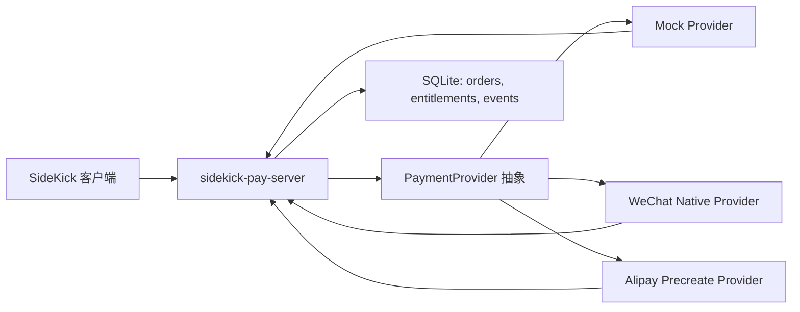

# 支付核验与商户二维码配置设计

## 背景

当前「支持作者」面板使用本地微信个人收款码，用户扫码后手动点击「我已支持（10元以下）」或「我已支持（10元及以上）」写入 `config.json`。这条链路有三个根本问题：

- 支付状态完全依赖用户点击，无法验证真实支付。
- 金额档位依赖用户自报，无法确认是否大于等于 10 元。
- 弹窗频次依赖本地自报状态，无法和真实支持权益绑定。

目标是改成「新建官方支付后端 + 客户端联动」。客户端只展示动态二维码、轮询订单和消费权益状态；后端负责创建订单、平台回调验签、查单、金额核验和权益计算。第一阶段必须先 mock 商户二维码配置板块，并通过 mock provider 完成前后端联调。

## 目标

1. 新建后端项目 `~/IdeaProjects/sidekick-pay-server`，提供支付订单、回调、查单和权益接口。
2. 支持微信和支付宝两个支付渠道的抽象，第一版用 mock provider 跑通链路，真实官方 provider 留出配置接口。
3. 客户端新增支付服务配置页，用现有 CustomTkinter/iOS 风格 mock 商户二维码配置和联调状态。
4. 「支持作者」面板不再使用个人静态收款码和手动登记按钮，改为动态订单二维码和状态轮询。
5. 金额大于等于 10 元时，由服务端返回 `supporter` 权益和 `support_until`，客户端据此控制弹窗频次。
6. 前后端联调到可交付：后端 mock provider 能创建订单、支付确认、金额不足/达标分支；客户端能展示二维码、轮询到状态、更新权益缓存。

## 非目标

- 第一阶段不在客户端保存微信商户私钥、支付宝应用私钥、API key 或证书。
- 第一阶段不要求真实微信/支付宝生产商户凭证可用；真实 provider 可以留配置项和接口边界，但交付验证以 mock provider 为准。
- 不做用户账号体系，不要求手机号、登录或云端账户绑定。
- 不做复杂订阅/自动续费，只做一次性支持后延长权益。

## 架构



服务端是可信边界。客户端提交 `install_id`、渠道和金额，服务端创建订单并返回二维码内容。支付完成由 provider 回调或查单确认，服务端写入订单和权益。客户端只读取 `entitlement`，不能自报支付状态。

## 后端项目

路径：`~/IdeaProjects/sidekick-pay-server`

技术栈：

- Python 3.10+
- FastAPI
- SQLAlchemy
- SQLite
- pytest
- uvicorn
- qrcode 或纯文本二维码内容返回

模块边界：

- `app/main.py`：FastAPI 应用、路由注册。
- `app/config.py`：环境变量和默认配置。
- `app/db.py`：SQLite engine/session 初始化。
- `app/models.py`：`Order`、`Entitlement`、`PaymentEvent`。
- `app/schemas.py`：请求/响应 Pydantic 模型。
- `app/providers/base.py`：`PaymentProvider` 协议和 provider 结果类型。
- `app/providers/mock.py`：本地联调用 mock 支付 provider。
- `app/providers/wechat.py`：微信 Native 支付 provider 边界，第一版可返回未配置错误。
- `app/providers/alipay.py`：支付宝预创建 provider 边界，第一版可返回未配置错误。
- `app/services/payment_service.py`：订单状态机、金额核验、权益延长、幂等处理。

## 后端接口

### 权益查询

`GET /api/v1/entitlements/{install_id}`

返回：

```json
{
  "install_id": "sidekick-install-id",
  "tier": "free",
  "support_until": null,
  "last_paid_amount_cents": 0,
  "last_provider": null,
  "server_time": "2026-06-13T12:00:00+08:00"
}
```

当 `support_until` 晚于 `server_time` 时，客户端视为支持者，不自动弹提醒。

### 创建订单

`POST /api/v1/orders`

请求：

```json
{
  "install_id": "sidekick-install-id",
  "provider": "mock",
  "amount_cents": 1000
}
```

响应：

```json
{
  "order_id": "sk_20260613_000001",
  "provider": "mock",
  "amount_cents": 1000,
  "status": "pending",
  "qr_code": "sidekick-pay://mock/sk_20260613_000001?amount=1000",
  "expires_at": "2026-06-13T12:10:00+08:00"
}
```

`provider` 支持 `mock`、`wechat`、`alipay`。第一版客户端默认使用 `mock`，配置页允许切换为微信/支付宝但在后端未配置时显示明确错误。

### 订单查询

`GET /api/v1/orders/{order_id}`

返回订单状态：

```json
{
  "order_id": "sk_20260613_000001",
  "status": "paid",
  "paid_amount_cents": 1000,
  "tier": "supporter",
  "support_until": "2026-07-13T23:59:59+08:00"
}
```

状态枚举：`pending`、`paid`、`expired`、`failed`。

### Mock 支付确认

`POST /api/v1/mock/orders/{order_id}/pay`

请求：

```json
{
  "paid_amount_cents": 1000
}
```

此接口只在 `SIDEKICK_PAY_ENABLE_MOCK=true` 时启用，用于本地联调和测试。金额 `< 1000` 时订单可以是 `paid`，但权益仍为 `free`。

### 支付回调

`POST /api/v1/webhooks/wechat`

`POST /api/v1/webhooks/alipay`

第一版提供接口和事件记录，mock provider 覆盖幂等处理。真实 provider 后续补齐验签、解密、查单和官方字段映射。

## 客户端配置页

入口放在顶部 `⋯` 菜单中：

- `支付服务设置…`
- 继续保留 `支持作者…`

配置页使用和 `AI / 知识库设置` 相同的 `CTkToplevel` 样式，宽度约 420，高度约 520。

配置项：

- 支付服务地址：默认 `http://127.0.0.1:8787`
- 当前 provider：`Mock` / `微信支付` / `支付宝`
- 默认支持金额：默认 `10.00` 元
- Mock 商户二维码预览：展示创建订单后返回的二维码内容生成的二维码图，或在未安装二维码库时展示短文本和复制按钮。
- 联调按钮：
  - `测试连接`：请求 `/healthz`
  - `生成测试二维码`：调用 `POST /api/v1/orders`
  - `模拟支付成功`：仅 mock provider 下调用 mock 支付确认接口

客户端配置写入 `config.json`：

```json
{
  "payment_server_url": "http://127.0.0.1:8787",
  "payment_provider": "mock",
  "payment_default_amount_cents": 1000,
  "payment_install_id": "uuid",
  "payment_entitlement_cache": {
    "tier": "free",
    "support_until": null,
    "last_checked_at": "2026-06-13T12:00:00+08:00"
  }
}
```

配置页是 mock 板块的主要交付物之一。它必须能在没有真实商户号的情况下完成完整演示：测试连接、生成二维码、模拟支付、看到权益变成支持者。

## 支持作者面板

旧逻辑：

- 展示 `assets/donation-wechat.jpg`
- 用户点击手动登记金额档位

新逻辑：

- 打开面板时读取服务端权益状态。
- 未支持或权益过期时展示渠道选择和动态二维码。
- 生成订单后每 2 秒轮询订单状态，最多轮询到 `expires_at`。
- 支付成功后展示「已支持，有效期至 YYYY-MM-DD」并停止轮询。
- 不再显示「我已支持（10元以下）」和「我已支持（10元及以上）」按钮。

## 弹窗频控

成功发送消息后调用新的策略：

1. 本地成功发送计数仍递增，失败发送不计数。
2. 如果本地权益缓存中 `support_until` 晚于当前时间，不自动弹支持作者面板。
3. 如果缓存缺失、过期或后端不可用，则免费用户每 10 次成功发送弹一次。
4. 支持作者面板打开时会尝试刷新服务端权益；刷新成功后写回缓存。
5. 支付成功且金额 `>= 1000` 分后，服务端延长一个自然月权益；客户端更新缓存后停止自动提醒。

金额不足规则：

- 支付金额 `< 1000` 分：后端记录真实支付，但返回 `tier=free`，不延长 `support_until`。
- 客户端可显示「已收到支持，但 10 元以上才停止提醒」。

## 失败与降级

- 后端不可达：配置页和支持面板显示错误，支持面板降级为免费频控，不允许用户自报支付成功。
- provider 未配置：后端返回 `provider_not_configured`，客户端提示「当前渠道未配置，请在后端 `.env` 配置商户参数」。
- 订单过期：客户端停止轮询，允许重新生成二维码。
- 重复回调：后端以订单状态和事件唯一键保证幂等。
- 客户端重启：根据 `install_id` 查询权益；如后端不可达，使用本地缓存。

## 测试策略

后端测试：

- 创建 mock 订单返回 `pending` 和二维码内容。
- mock 支付 `< 1000` 分后订单为 `paid`，权益仍为 `free`。
- mock 支付 `>= 1000` 分后权益为 `supporter`，`support_until` 延长一个自然月。
- 重复支付确认不重复延长权益。
- 过期订单不能支付成功。
- provider 未配置返回明确错误。

客户端测试：

- 生成稳定 `payment_install_id` 并持久化。
- 支付配置默认值正确。
- `PaymentClient` 能请求 health、创建订单、查询订单、模拟支付。
- 本地权益未过期时不自动弹窗。
- 权益过期或服务端不可达时回到每 10 次提醒。
- 旧 `donation_profile` 不再作为可信支付状态。

联调验证：

1. 启动 `sidekick-pay-server`。
2. 客户端配置页测试连接成功。
3. 配置页生成 mock 二维码。
4. 点击模拟支付成功。
5. 客户端查询到 `supporter` 和 `support_until`。
6. 触发发送成功逻辑，确认未过期权益不会自动弹支持作者面板。

## 官方支付后续接入边界

微信支付 Native provider：

- 后端读取商户号、AppID、证书序列号、API v3 key、商户私钥路径。
- 创建 Native 订单并返回 `code_url`。
- 接收回调、验签、解密 resource、核对商户订单号和金额。
- 回调缺失时通过订单查询补偿。

支付宝 provider：

- 后端读取 app_id、应用私钥、支付宝公钥、网关地址。
- 调用预创建接口生成二维码。
- 接收异步通知并验签。
- 通知缺失时通过交易查询补偿。

真实 provider 不改变客户端协议，只替换后端 provider 实现。
